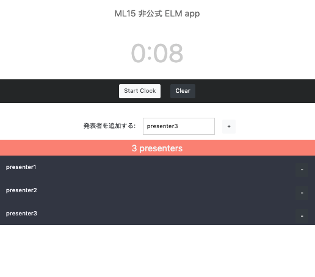
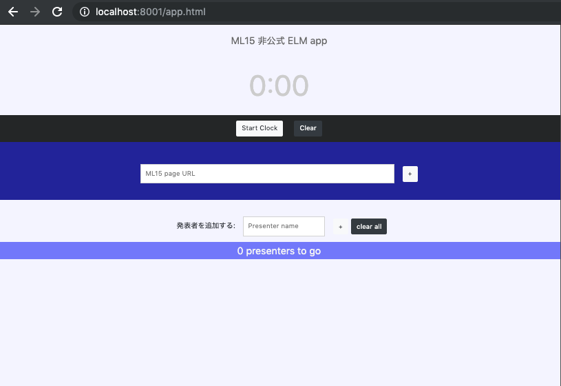

### Intro
A simple frontend-only single-page web app in Elm for managing presenter schedule on ML15.

Uses elm version 0.19.0.

Use as a sample of how to use ports, subscriptions etc. in elm.

Elm entrypoint is App.elm. App component is embedded in app.html, so the webpage can be viewed by navigating to app.html after starting up elm reactor.

Add presenters by the + icon, start clock, remove when finished with - next to each presenter. Warning chime sounds at 14 minutes, Finish gong sounds at 15.




Also if you enter the link to the website of the ML15 event, it will automatically add the presenters from the content of the page. Input the url into the input bar with ML15 page URL.

#### Start server
```
pip install -r requirements.txt
cd ml15min/server && python server.py
```
Runs on python3.7

Site will be visible from localhost:8001/app.html




#### Build Elm
```
elm make src/App.elm --output src/app.js
elm reactor
```

Site will be visible from localhost:8000/src/app.html by default.

(.m4a files are proprietary and not included. Please substitute as necessary.)

